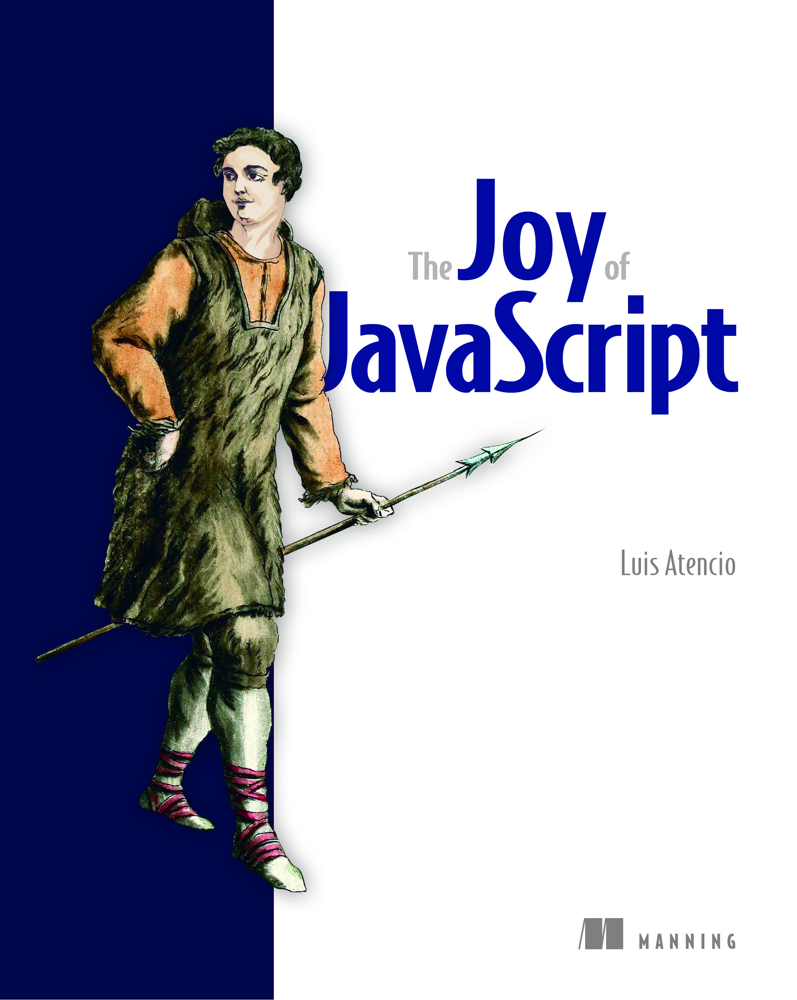

# The Joy of JavaScript (TJoJS)

# 关于本书

---

Thank you for becoming an early adopter of `The Joy of JavaScript` (`TJoJ`), and welcome! To get the most out of this book, you’ll want to have a professional grasp of JavaScript either on the server or the client side, as well as an interest in learning new ways to write JavaScript.

感谢您成为 `The Joy of JavaScript` (`TJoJ`) 一书的预订读者，欢迎！为了充分利用本书，您需要对服务器端或客户端的 `JavaScript` 有专业的掌握，并且对学习编写 `JavaScript` 的新方法感兴趣。

In these strange and turbulent times of seclusion and social distancing, reading and writing  have become my escape. I hope that reading  this book can help you get through this “coronanxiety,” just as writing it is helping me, and that we can come out of this crisis stronger and more motivated.

在这个相互隔离、远离社交的陌生而动荡的时代，阅读和写作成了我的避风港。希望阅读本书能像创作本身对我有帮助一样，可以帮你熬过“新冠焦虑”，能够更加坚强、更有动力地走出这场危机。

We’re at the perfect point of inflection for a book like Joy of JavaScript. The language is moving at a frantic pace, and this book allows you to jump ahead and begin to grasp the stream of new proposals and modern programming idioms that will equip you to tackle today’s challenges in the cleanest, most elegant way; and have fun while doing it!

对于像 `Joy of JavaScript` 这样的书而言，我们正处于绝佳的转折点。`JavaScript` 这门语言正以疯狂的速度发展。而这本书将让你与时俱进，谙熟最新的提案并紧跟现代编程惯例的潮流，以最简洁、最优雅的方式应对当今业界的挑战；并在实干中收获乐趣！

I began coding `JavaScript` many years ago, but really became passionate about it when I surfed the functional and reactive programming wave that began about four years ago. This opened up my eyes to a completely different perspective on the language, while inspiring me to write Manning titles like `Functional Programming in JavaScript` and `RxJS in Action`.

多年前我就开始用 `JavaScript` 编程，但直到我注意到大约四年前（2016~2017年）开始的函数式和响应式的编程潮流时，我才真地对它充满热情。这让我对这门语言有了一个完全不同的视角，同时激发了我写 Manning 的书，比如那本《`JavaScript` 函数式编程指南》，以及那本《`RxJS` 实战》。

As excited as I was about writing those books, I always felt I was overlooking a whole dimension of the language: objects. Objects are the fabric of the language. This book reveals JavaScript’s true multi-paradigmic nature, and shows how all of the new features supports these paradigms. The book starts with foundational concepts that teach different alternatives for modeling your objects. The second part connects these pieces together in a compositional, functional manner. With the models in place, part three deals with how to properly architect and organize code around JavaScript’s new module system. Finally, you’ll learn how to code asynchronously using JavaScript’s data protocols, as well as how to scale to infinite amounts of data using streams. 

尽管热衷于写这些书，但我总觉得自己忽略了这门语言的一个完整维度：对象。对象是语言的组成部分。本书揭示了 `JavaScript` 多范式的真正本质，并展示了新语言特性对这些范式的支持情况及实现方式。本书开篇从基本概念入手，讲解了对象建模的各种可选方案；第二部分以组合式的、函数式编程的方式将这些零散的部分连在一起。模型就位后，第三部分将探讨如何利用 `JavaScript` 的新模块系统正确地构建及组织代码。最后，您将了解到使用 `JavaScript` 的数据协议进行异步编码的方法，以及运用流（`stream`）的概念将其推广到无穷数据量的场景下。

Unlike most JavaScript books and tutorials, this book relies entirely on plain, vanilla JavaScript with no dependencies on third-party libraries or frameworks. Throughout each chapter, you’ll learn about the new proposals and features that are currently being standardized and the paradigms that embrace these features.

与大多数 `JavaScript` 书籍和教程不同，本书完全基于原生 `JavaScript`，不依赖任何第三方库或框架。在每一章中，您都将了解到当前正在标准化的新提案和功能，以及包含这些功能的范例。

The Joy of JavaScript is not a guide or cookbook for writing ECMAScript 2016, 2017, etc. You can find that easily online. Rather, it aims at showcasing new programming idioms, techniques, and sound computer science topics in the context of tackling a real-world problem—underpinning what we know today as modern JavaScript application development. 

这本《`JavaScript` 的乐趣》并非是可以在网上轻松找到的、重点介绍 `ECMAScript 2016`、`ECMAScript 2017` 等语言规范的指南书或实用手册。本书旨在解决现实世界问题的背景下，进一步介绍新的编程惯例、编程技术及完备的计算机科学主题，以支撑当前的现代 `JavaScript` 应用程序开发。

Finally, if you have any questions, comments, or suggestions, please share them in Manning’s `LiveBook` platform: https://livebook.manning.com/book/the-joy-of-javascript/discussion.

最后，如果您有任何问题、意见或建议，请分享到 `Manning` 出版社的 `LiveBook` 平台：https://livebook.manning.com/book/the-joy-of-javascript/discussion。

—Luis Atencio

——路易斯·阿滕西奥

    

# Running the code

# 运行示例代码

You have a couple of options to run the code. If you have Node.js v14 installed locally in your system or would like to upgrade, feel free to run the tests locally; otherwise, if for some reason you can't upgrade your system's Node.js version, you can run the code housed in a Docker container.

您有多种选择来运行本书示例代码。如果在本地安装了或可以升级到 `Node.js v14` 及以上，则可以在本地自如运行测试用例；倘若无法升级 `Node.js` 版本，您也可以运行存放在 `Docker` 容器中的代码。

Assuming you have Git installed, you can download the code with the following git command:

假设您已经安装了 `Git`，则使用以下 `git` 命令下载代码：

~~~bash
git clone https://github.com/JoyOfJavaScript/joj.git
~~~

## Upgrading to Node.js 14 

## 升级到 `Node.js 14`

If you'd like to upgrade your system to Node.js 14, please follow these instructions: 

1. Run `node -v` to confirm your existing Node.js version
2. Run `sudo npm install -g n` to install the `n` package. This library makes upgrading Node.js simple
3. Upgrade to latest 14.x.x version running `sudo n 14.12.0`

### Running locally with your own installed version of Node.js
The repo contains two projects: *blockchain* and *chapter-listings* in `src` folder. You must first initialize *blockchain*. 

`cd` to the `blockchain` project and run: `npm install; npm run build`

Next, `cd` into `chapter-listings` projects and run `npm install`.

#### Running all tests
Now, you should be able to run all chapter listings by running: `npm run test-all`

You should > 200 unit tests passing. 

You can also run the `blockchain` tests by navigating to that folder and running the same command `npm run test-all`

You should see around 100 unit tests passing. 

#### Running an individual test
The Joy of JavaScript teaches a few non-standard, future features. Hence, to run an individual chapter listing test file, you must first transpile the code with Babel. 
In `chapter-listings` , run `npm run build`. This will transpile all files into `_babel` directory. 
To run a test, execute `npm run test ./_babel/src/ch05/[listing-number].spec.mjs`

## Running inside a container 

## 在容器中运行

If for some reason you can't upgrade your system's Node.js version, you can run the code inside a Docker container. 

First, you need to download and install the Docker Desktop plugin corresponding to your platform (MacOS, Windows, etc). You can find that in [https://www.docker.com/products/docker-desktop]

Once installed, navigate to the top level folder `joj` of the cloned repository. There you will find a `docker-compose.yml` file. 
With Docker, you only have the option to run all tests. To do so, just run: `docker-compose up`. This will run all *blockchain* tests first, then all *chapter-listings* tests. 
Afterwards, you can run `docker-compose down` to tear down the enrivonment. 
